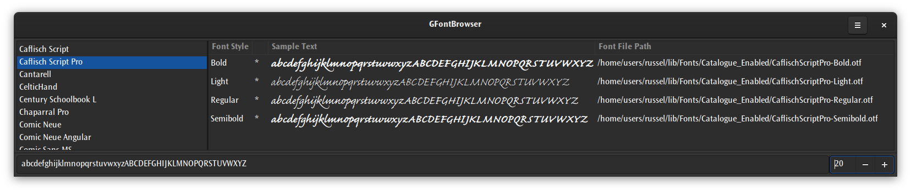

# GFontBrowser — A font browser for GTK+, Fontconfig, Pango based systems.

GitLab CI: 
&nbsp;&nbsp;&nbsp;&nbsp;
Travis-CI: 

Licence: 

## Introduction

This application allows browsing and investigating the fonts that are installed on your system – which is
assumed to be one on which GTK+3, Fontconfig, and Pango are installed.

This application was originally to solve a fonts browsing problem I had that no GNOME tool solved (there
still isn't), and it serves that purpose – though it could be improved a lot.

## Using GFontBrowser

Here is an image of the main window with a font selected:

## Building for Yourself

The de facto build system for D programs is [Dub](https://github.com/dlang/dub) and so there is a Dub build
capability. Increasingly [Meson](http://mesonbuild.com/) is the de facto build tool for GTK-related builds
on Linux, so there is a Meson build capability. I like [SCons](https://www.scons.org/) so that it supported
as well.

Dub and SCons work directly in the project directory, but they are nonetheless out-of-tree builds. So you
can run:

    dub build

or:

    scons

in the project directory to build the project. Both builds support _build_, _run_, and _test_ targets.

As an example of building using Meson, if this clone is in ~/Repositories/Git/GFontBrowser\_D,
then create a build location, for example ~/BuildArea/GFontBrowser\_D, cd to that directory and then:

    meson --prefix=$HOME/Built ~/Repositories/Git/GFontBrowser_D

will construct a Ninja build. Then:

    ninja
    ninja install

should do the right thing building and installing the executable. It is assumed people have a ~/Built place
for installing things they build themselves. You may need to adjust accordingly.

## Licence

This code is licenced under GPLv3. 
